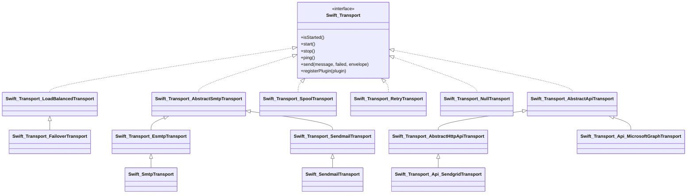

# Architecture

An internals guide for developers working **on** SwiftMailer, not just with it. It
maps the code in `lib/classes/Swift/` to the concepts that hold it together:
autoloading, the dependency container, the transport hierarchy, the send flow, the
MIME subsystem, events, and the DSN/webhook/signer subsystems. Everything here was
verified against the source; file paths are clickable.

For user-facing usage, see the companion chapters instead of duplicating them here:
[sending.md](sending.md), [messages.md](messages.md), [headers.md](headers.md),
[plugins.md](plugins.md), [events.md](events.md), [dsn.md](dsn.md),
[api-transports.md](api-transports.md), [webhooks.md](webhooks.md),
[upgrading.md](upgrading.md), and the Microsoft Graph guide in
[microsoft-graph.md](microsoft-graph.md).
The fork's Symfony Mailer feature mapping lives in
[../docs/SYMFONY_MAILER_PARITY.md](../docs/SYMFONY_MAILER_PARITY.md).

## Contents

- [Code layout and naming](#code-layout-and-naming)
- [Autoloading and bootstrap](#autoloading-and-bootstrap)
- [The dependency container](#the-dependency-container)
- [Preferences](#preferences)
- [Transport hierarchy](#transport-hierarchy)
- [The send flow](#the-send-flow)
- [MIME subsystem](#mime-subsystem)
- [Event system internals](#event-system-internals)
- [DSN subsystem](#dsn-subsystem)
- [Webhook subsystem](#webhook-subsystem)
- [Signers](#signers)
- [CLI](#cli)
- [Testing](#testing)

## Code layout and naming

The library predates PHP namespaces and uses **PSR-0 underscore class names**:
`Swift_Mime_SimpleMessage` lives at `lib/classes/Swift/Mime/SimpleMessage.php`.
Each `_` is a directory separator under `lib/classes/`. Composer does **not**
register a PSR-0 map for these — autoloading is handled by `lib/swift_required.php`
(see below), which `composer.json` pulls in via `autoload.files`.

| Path | Role |
|-|-|
| `lib/classes/Swift/` | All library classes (PSR-0, underscore-named) |
| `lib/swift_required.php` | Autoload entry point + global constants |
| `lib/classes/Swift.php` | `Swift` utility class: autoloader + init hooks + `VERSION` |
| `lib/functions.php` | Namespaced helpers (`Swift\base64url_encode`, `obfuscate`, `getRawMessage`) |
| `lib/dependency_maps/` | Service registrations for the `Swift_DependencyContainer` |
| `lib/preferences.php` | Boots global defaults (charset, cache type) |
| `lib/mime_types.php` | Extension → MIME type map (consumed by attachments) |
| `lib/class_aliases.php` | `Swift\Message` → `Swift_Message` forward-compat aliases |
| `class_map.php` | Underscore → namespace map (used by Rector migration) |
| `generate_class_map.php` | Regenerates `class_map.php` from the source tree |
| `rector.php` | Namespace-migration tooling (opt-in, reads `class_map.php`) |

Tests mirror the source tree under `tests/unit/Swift/` using the same underscore
naming (`tests/unit/Swift/Mime/SimpleMessageTest.php`).

### Forward-compatible namespaced aliases

`lib/class_aliases.php` registers a `class_alias()` for every class, so callers may
write `Swift\Message` instead of `Swift_Message`. It is loaded eagerly at the end of
`swift_required.php`. `class_map.php` (the underscore → namespace map) is produced by
`generate_class_map.php`, which parses `lib/` with nikic/php-parser; `rector.php`
consumes that map to drive an optional full namespace migration
(`RenameUnderscoreToNamespaceRector` + `RenameClassRector`). None of this is required
at runtime — it exists to ease an eventual move off underscore names.

## Autoloading and bootstrap

`lib/swift_required.php` is the single entry point. In order it:

1. Defines the three connection-encryption constants
   (`CONNECTION_ENCRYPTION_MODE_STARTTLS`/`_TLS`/`_NONE`).
2. `require`s `Swift.php` and `functions.php`.
3. Calls `Swift::registerAutoload(...)` with a closure that lazily loads the four
   dependency maps (`cache_deps`, `mime_deps`, `message_deps`, `transport_deps`) and
   `preferences.php`.
4. `require`s `class_aliases.php` eagerly.

`Swift::autoload()` (in `lib/classes/Swift.php`) is registered with
`spl_autoload_register`. It ignores any class name not prefixed `Swift_`, maps the
rest to a path under `lib/classes/`, and — the first time a Swift class is actually
loaded — runs every registered init callback exactly once (guarded by
`Swift::$initialized`). That lazy hook is why the dependency maps and preferences only
cost anything once you touch the library.

`Swift::init($callable)` lets application code register its own tweak that runs at the
same first-load moment (e.g. to override a service before anything resolves it).
`Swift::VERSION` is the authoritative version string.

## The dependency container

`Swift_DependencyContainer` (`lib/classes/Swift/DependencyContainer.php`) is an
internal service locator — a singleton registry that wires component graphs together
so callers never hand-assemble encoders, header factories, and streams. It is **not**
a general-purpose DI container and is not part of the public API surface you build
apps against; it is how the library constructs itself.

### Registration types

Services are declared with a fluent `register($name)->as…()` chain. Five lookup types
exist, each a bit flag constant:

| Type | Builder | Meaning |
|-|-|-|
| `TYPE_VALUE` | `asValue($v)` | Literal value returned as-is |
| `TYPE_INSTANCE` | `asNewInstanceOf($class)` | Fresh instance on every lookup |
| `TYPE_SHARED` | `asSharedInstanceOf($class)` | Lazily created once, then reused |
| `TYPE_ALIAS` | `asAliasOf($name)` | Resolves to another registered item |
| `TYPE_ARRAY` | `asArray()` | Resolves a list of dependencies into an array |

Constructor arguments are declared with `withDependencies([...])` (a list of lookup
names), `addConstructorLookup($name)`, or `addConstructorValue($literal)`. At
`lookup()` time, arguments are resolved recursively via reflection
(`ReflectionClass::newInstanceArgs`), so `mime.message` pulls in `mime.headerset`,
which pulls in `mime.headerfactory`, and so on.

### The dependency maps

Four files under `lib/dependency_maps/` populate the container. They are loaded lazily
on first Swift-class autoload:

| Map | Registers |
|-|-|
| `cache_deps.php` | `cache` (alias, defaults to `cache.array`), `cache.array`/`cache.disk`/`cache.null` KeyCaches, `tempdir` |
| `mime_deps.php` | Message/part/attachment builders, header factory + set, all content/header encoders, character stream, id generator, email validator |
| `message_deps.php` | `message.message` → `Swift_Message`, `message.mimepart` → `Swift_MimePart` |
| `transport_deps.php` | SMTP/sendmail/spool/null transports, the ESMTP handler stack, SASL authenticators, the shared event dispatcher, address encoders |

Note the two hardened `localdomain`/`idright` registrations in `transport_deps.php`
and `mime_deps.php`: `$_SERVER['SERVER_NAME']` is sanitized with `preg_replace` (not
`preg_match`, to avoid ReDoS on long hostnames) before being trusted as the local
domain / Message-ID right-hand side.

### Overriding a service

Because registration is just mutation of the singleton store, you override a service
by re-registering its name **before it is first resolved** — typically from a
`Swift::init()` callback or via `Swift_Preferences`. Example:

```php
Swift::init(function () {
    Swift_DependencyContainer::getInstance()
        ->register('cache')
        ->asAliasOf('cache.disk');
});
```

### Hardening: bounded lookups and validated names

`lookup()` is guarded by a recursion counter: `MAX_LOOKUP_DEPTH = 20`. If resolution
recurses deeper (a circular dependency), it throws `Swift_DependencyException`
("Circular dependency detected…") instead of exhausting the stack. Unknown names throw
the same exception type.

The container itself does not sanitize service names, but the two public seams that
accept a caller-supplied name do:

- `Swift_Mailer::createMessage($service)` rejects anything not matching
  `^[a-zA-Z0-9_-]+$` before prefixing `message.` and looking it up.
- `Swift_Preferences::setCacheType($type)` allowlists `array`/`disk`/`null`.

## Preferences

`Swift_Preferences` (singleton) is the sanctioned front door for the few global knobs,
each of which simply re-registers a container service:

| Method | Effect |
|-|-|
| `setCharset($c)` | Registers `properties.charset` |
| `setTempDir($dir)` | Registers `tempdir` (used by the disk cache) |
| `setCacheType($t)` | Aliases `cache` to `cache.array`/`cache.disk`/`cache.null` |
| `setQPDotEscape($b)` | Rebuilds the QP content encoder with dot-escaping on/off |

`lib/preferences.php` applies the defaults at bootstrap: UTF-8 charset, and — if
`sys_get_temp_dir()` is writable — switches the cache from the memory-hungry `array`
default to `disk`. Override `TMPDIR` in the environment to relocate the disk cache.

## Transport hierarchy

The transport layer is the core abstraction. `Swift_Transport`
(`lib/classes/Swift/Transport.php`) is the interface every transport implements:
`isStarted()`, `start()`, `stop()`, `ping()`, `send()`, and `registerPlugin()`.
`send()` accepts an optional explicit `Swift_Envelope` to override the SMTP
sender/recipients independently of message headers.



### SMTP branch

`Swift_Transport_AbstractSmtpTransport` holds the SMTP conversation logic (greeting,
HELO/EHLO, MAIL FROM / RCPT TO, DATA, event dispatch). Two concretes extend it:

- `Swift_Transport_EsmtpTransport` — ESMTP with a pluggable handler stack
  (`AuthHandler`, `SmtpUtf8Handler`, `EightBitMimeHandler`) and SASL authenticators
  (CRAM-MD5, LOGIN, PLAIN, NTLM, XOAUTH2). It also implements
  `Swift_Transport_SmtpAgent`.
- `Swift_Transport_SendmailTransport` — pipes to a local sendmail binary.

### API branch

`Swift_Transport_AbstractApiTransport` implements the `Swift_Transport` lifecycle
(start/stop, event dispatch, `registerPlugin`, serialization blocking) and leaves
`start()`/`ping()`/`send()`/`getApiConnection()` abstract.

`Swift_Transport_AbstractHttpApiTransport` extends it for **HTTP/JSON providers**: it
takes `(#[SensitiveParameter] string $apiKey, ?ClientInterface $httpClient, ?EventDispatcher)`,
owns a Guzzle client, and drives the full `send()` template — event dispatch,
`doSend()`, recipient counting, `Swift_SentMessage` construction, failure handling,
and response-size capping (`MAX_RESPONSE_SIZE` = 1 MB). Concrete providers implement
`doSend()`, `getEndpoint()`, `getAuthHeaders()`, `parseResponse()`, and
`getPingEndpoint()`. It also provides the shared helpers for extracting body parts,
attachments, and `X-Mailer-Tag` / `X-Mailer-Metadata-*` headers.

There are **21** concrete transports under `lib/classes/Swift/Transport/Api/`. Seventeen
are HTTP/JSON and extend `AbstractHttpApiTransport` (AhaSend, Azure, Brevo, InfoBip,
MailChimp, Mailgun, Mailjet, MailPace, MailerSend, Mailomat, Mailtrap, Postmark,
Postal, Resend, Scaleway, SendGrid, Sweego). Four are backed by a vendor SDK client
rather than a raw HTTP key and so extend `AbstractApiTransport` directly:
`AmazonSesApiTransport`, `AmazonSesHttpTransport`, `GoogleTransport`,
`MicrosoftGraphTransport`. See [api-transports.md](api-transports.md) for per-provider
constructors and auth. The `Api/Calendar/` subfolder (`IcsParser`, `ParsedEvent`) is a
dependency-free helper for the Graph calendar-invite feature, not a transport — see
[microsoft-graph.md](microsoft-graph.md).

### Meta-transports

These wrap other transports rather than talking to a server:

| Class | Behavior |
|-|-|
| `Swift_Transport_LoadBalancedTransport` | Round-robins sends across a pool |
| `Swift_Transport_FailoverTransport` | Extends LoadBalanced; tries the next only when one fails |
| `Swift_Transport_RetryTransport` | Retries a single inner transport with exponential backoff (`Swift_Transport_RetryClassifier` / `DefaultRetryClassifier` decide what is retryable) |
| `Swift_Transport_SpoolTransport` | Queues to a `Swift_Spool` (`Swift_FileSpool`/`Swift_MemorySpool`) for deferred flushing |
| `Swift_Transport_NullTransport` | Discards mail; useful for tests |

### Facade classes

The short top-level names most user code uses are thin subclasses of the `Transport/*`
internals that pre-wire container-provided collaborators (buffers, handler stacks,
event dispatcher) so callers can `new` them directly:

| Facade | Extends |
|-|-|
| `Swift_SmtpTransport` | `Swift_Transport_EsmtpTransport` |
| `Swift_SendmailTransport` | `Swift_Transport_SendmailTransport` |
| `Swift_NullTransport` | `Swift_Transport_NullTransport` |
| `Swift_FailoverTransport` | `Swift_Transport_FailoverTransport` |
| `Swift_LoadBalancedTransport` | `Swift_Transport_LoadBalancedTransport` |
| `Swift_SpoolTransport` | `Swift_Transport_SpoolTransport` |

## The send flow

`Swift_Mailer::send($message, &$failedRecipients, ?$envelope)` is the orchestration
entry point:

1. Normalizes `$failedRecipients` to an array.
2. Starts the transport if not already started (a 7.0-transitional guard — transports
   also self-start inside `send()`).
3. Delegates to `$transport->send(...)`, catching `Swift_RfcComplianceException` and
   recording every `To:` address as failed if the message is malformed.
4. Returns the count of accepted recipients (`0` means total failure).

Inside a transport's `send()` (both the SMTP and HTTP API bases follow the same
shape):

```
createSendEvent → dispatch 'beforeSendPerformed'
    │  (a listener may reject()/cancelBubble → short-circuit to 0)
    ▼
doSend / SMTP conversation  ──►  build Swift_SentMessage
    │                                   │
    │ success                          ▼
    │                          dispatch 'sentMessage' (SentMessageEvent)
    │ failure
    ▼
wrap in Swift_TransportException, setFailedRecipients,
dispatch 'failedMessage' (FailedMessageEvent), throwException()
    ▼
finally: dispatch 'sendPerformed' (SendEvent), clear active envelope
```

Supporting value objects:

- `Swift_Envelope` (readonly) — the SMTP MAIL FROM + RCPT TO, decoupled from headers.
  Build it explicitly, or `Swift_Envelope::fromMessage()` derives it (sender priority
  Return-Path → Sender → From; recipients = To + Cc + Bcc). It validates a non-empty
  sender and at least one recipient.
- `Swift_SentMessage` (readonly) — result of a successful send: original message,
  transport, provider message-id, recipient count, debug payload, failed recipients.
  Carried by `SentMessageEvent`; `with*()` methods return modified copies.
- `Swift_SendResult` — an `int`-backed enum (PENDING/SPOOLED/SUCCESS/TENTATIVE/FAILED)
  whose values match the legacy `Swift_Events_SendEvent::RESULT_*` bitmask constants,
  which the transports still set on the `SendEvent`.

See [sending.md](sending.md) for user-level send patterns and [events.md](events.md)
for the full event lifecycle.

## MIME subsystem

A message is a tree of MIME entities. `Swift_Mime_SimpleMimeEntity`
(`lib/classes/Swift/Mime/SimpleMimeEntity.php`) is the base: it owns a header set, a
body (string or `Swift_OutputByteStream`), a content type, a `KeyCache` slot, and a
list of child entities. `toString()` / `toByteStream()` render headers plus body,
recursing into children with MIME boundaries.

Nesting is governed by four **level** constants and a set of "compound ranges":

| Level | Value | Precedence |
|-|-|-|
| `LEVEL_TOP` | 16 | The message document itself (only one) |
| `LEVEL_MIXED` | 256 | Attachment precedence (`multipart/mixed`) |
| `LEVEL_ALTERNATIVE` | 4096 | Body-part precedence (`multipart/alternative`) |
| `LEVEL_RELATED` | 65536 | Embedded-content precedence (`multipart/related`) |

When children are attached, the entity picks the multipart content type whose range
spans the children's levels, and re-sorts so, e.g., a `text/plain` alternative sorts
before `text/html`. `Swift_Mime_SimpleMessage` (which `Swift_Message` extends) pins
itself to `LEVEL_TOP` and adds message-level headers (Subject, From/To/Cc/Bcc, Date,
Message-ID, priority, read receipts). `Swift_Mime_MimePart`, `Swift_Mime_Attachment`,
and `Swift_Mime_EmbeddedFile` are the other entity flavors; the short
`Swift_MimePart`/`Swift_Attachment`/`Swift_EmbeddedFile`/`Swift_Image` classes are
convenience facades wired through the container. See [messages.md](messages.md).

### Headers

`Swift_Mime_SimpleHeaderSet` holds ordered headers built by
`Swift_Mime_SimpleHeaderFactory`. Header types live in `Swift/Mime/Headers/`:
`UnstructuredHeader`, `DateHeader`, `MailboxHeader`, `IdentificationHeader`,
`PathHeader`, `ParameterizedHeader`, and `OpenDKIMHeader`, all extending
`AbstractHeader`. See [headers.md](headers.md).

### Encoders, streams, and caches

| Concern | Classes |
|-|-|
| Content transfer encoding | `Swift/Mime/ContentEncoder/*` (QP proxy → native/safe QP, Base64, 7bit/8bit plain, raw, null) |
| Header encoding | `Swift/Mime/HeaderEncoder/*` (QP, Base64) + `Swift/Encoder/*` (Base64, QP, RFC 2231) |
| Character handling | `Swift/CharacterStream/*` (`NgCharacterStream` is the default) + `Swift/CharacterReader/*` (US-ASCII, UTF-8, fixed-width) via `SimpleCharacterReaderFactory` |
| Byte streams | `Swift/ByteStream/*` (`ArrayByteStream`, `FileByteStream`, `TemporaryFileByteStream`) implementing `Swift_InputByteStream`/`Swift_OutputByteStream` |
| Encoding cache | `Swift/KeyCache/*` — two-key (`nsKey`, `itemKey`) store; `ArrayKeyCache` (memory) or `DiskKeyCache` (temp files), selected by preferences |
| Stream filters | `Swift/StreamFilters/*` — byte-array and string replacement (line-ending canonicalization, decorator substitutions) |
| ID generation | `Swift_Mime_IdGenerator implements Swift_IdGenerator` — `random_bytes(16)` hex + `@<idRight>` for Message-ID / Content-ID |

## Event system internals

`Swift_Events_SimpleEventDispatcher` (implementing
`Swift_Events_EventDispatcher`) is the hub. Its constructor holds an `eventMap` from
concrete event class → listener interface:

| Event | Listener interface | Notable targets |
|-|-|-|
| `Swift_Events_SendEvent` | `SendListener` | `beforeSendPerformed`, `sendPerformed` |
| `Swift_Events_CommandEvent` | `CommandListener` | SMTP command about to be sent |
| `Swift_Events_ResponseEvent` | `ResponseListener` | SMTP server response |
| `Swift_Events_TransportChangeEvent` | `TransportChangeListener` | `beforeTransportStarted/Started/Stopped` |
| `Swift_Events_TransportExceptionEvent` | `TransportExceptionListener` | `exceptionThrown` |
| `Swift_Events_SentMessageEvent` | `SentMessageListener` | `sentMessage` (post-success) |
| `Swift_Events_FailedMessageEvent` | `FailedMessageListener` | `failedMessage` (post-failure) |

`dispatchEvent($evt, $target)` builds a bubble queue of listeners whose type matches
the event's map entry, then **bubbles** recursively (`bubble()` shifts one listener,
calls `$listener->$target($evt)`, recurses) until the queue empties or a listener calls
`cancelBubble(true)`. That's the cancellation mechanism plugins use to veto a send.

Event objects extend `Swift_Events_EventObject` (base `Event`). One deliberate bit of
**cloning**: `Swift_Events_SendEvent::setEnvelope()`/`getEnvelope()` clone the
`Swift_Envelope` in and out, so a listener that mutates the envelope it reads cannot
retroactively corrupt another listener's view. `SendEvent` also adds `reject($reason)`
(sets a rejection flag and cancels bubbling) for the `AllowlistPlugin`-style veto path.

## DSN subsystem

Two classes turn connection strings into transports:

- `Swift_Dsn` (readonly) wraps a parsed nyholm/dsn object and holds the
  `TRANSPORT_CLASS_MAP` — scheme (`sendgrid`, `microsoft-graph`, `smtp+tls`,
  `mailtrap+sandbox`, …) → transport class. `getTransportClass()` throws
  `InvalidArgumentException` listing supported schemes on a miss.
- `Swift_Transport_DsnTransportFactory::fromDsnString()` is the real entry point. It
  recognizes the `retry(...)`, `failover(...)`, and `roundrobin(...)` wrapper syntax
  (recursing on the inner DSNs), validates query parameters against
  `ALLOWED_DSN_PARAMETERS` (unknown ones emit an `E_USER_WARNING`), and builds the
  concrete transport. SMTP schemes resolve provider host/port/encryption defaults from
  `SMTP_HOST_MAP`; a `?retries=` query parameter wraps the result in a
  `RetryTransport`. The sendmail path is constrained to an allowlist of binaries.

> `Swift::createTransportFromDsn()` exists but is dead code (annotated as such); use
> the factory. See [dsn.md](dsn.md) for the full scheme and parameter reference.

## Webhook subsystem

`Swift_Webhook_RequestHandler::handle()` processes inbound provider callbacks. Given a
provider `PayloadConverterInterface`, the raw body, headers, and signing secret it:
enforces a non-empty secret; optionally checks a remote-IP allowlist; **always**
verifies the signature (`Swift_Webhook_SignatureVerificationException` on failure);
optionally validates a timestamp against `maxAge` (default 300s) for replay
protection; decodes JSON; and returns normalized `Swift_Webhook_Event[]`. Fourteen
providers have converters under `Swift/Webhook/Converter/`, extending
`Swift_Webhook_AbstractPayloadConverter`. See [webhooks.md](webhooks.md).

## Signers

Message signing lives in `Swift/Signers/`:

| Signer | Purpose |
|-|-|
| `Swift_Signers_DKIMSigner` | DKIM (RSA-SHA256 and Ed25519-SHA256), header oversigning |
| `Swift_Signers_DomainKeySigner` | Legacy DomainKeys |
| `Swift_Signers_SMimeSigner` | S/MIME certificate signing (no encryption yet) |

`Swift_Signer`, `Swift_Signers_HeaderSigner`, and `Swift_Signers_BodySigner` are the
interfaces; messages accept a signer via `attachSigner()`.

## CLI

`bin/swiftmailer-test` sends a test message through any DSN to validate configuration
from the shell. It builds on `Swift/Cli/`: `ArgumentParser` (→ `ParsedArguments`,
or `HelpRequestedException`) and `ConsoleOutput`. It reads the DSN from
`SWIFTMAILER_DSN` (preferred — a DSN on the command line leaks credentials to the
process list, which the tool warns about) and masks the password when echoing.

## Testing

Tests run under PHPUnit via the Symfony PHPUnit bridge. `phpunit.xml.dist` defines four
suites, each a directory under `tests/`:

| Suite | Directory | Scope |
|-|-|-|
| `SwiftMailer unit tests` | `tests/unit` | Isolated class behavior (mirrors `lib/classes/Swift/`) |
| `SwiftMailer acceptance tests` | `tests/acceptance` | End-to-end against real services (config-gated) |
| `SwiftMailer bug` | `tests/bug` | Regression tests for specific fixed issues |
| `SwiftMailer smoke tests` | `tests/smoke` | Live smoke checks (config-gated) |

Run everything with `composer test`, a single file with
`vendor/bin/simple-phpunit tests/unit/Swift/SomeTest.php`, or one suite with
`--testsuite="SwiftMailer unit tests"`. `tests/bootstrap.php` disables the GC (segfault
workaround), adds `lib/` to the include path, boots Mockery, and pulls in the optional
`acceptance.conf.php`/`smoke.conf.php`. Mockery is registered as a PHPUnit listener
alongside `SymfonyTestsListener`.

### The deprecation baseline

The suite is expected to emit some known/intentional deprecations (from dependencies
and from PHP 8.4+ notices). `composer test` exports
`SYMFONY_DEPRECATIONS_HELPER='max[direct]=0&baselineFile=./tests/deprecation-baseline.json'`
so the bridge ignores exactly the baselined deprecations and the run exits `0`. This
**must** be set in the environment before PHPUnit starts — the bridge caches its config
at process start, before `phpunit.xml.dist`'s `<env>` block is applied. A bare
`vendor/bin/simple-phpunit` run therefore uses only `max[direct]=0` (no baseline) and
exits non-zero on those known deprecations. Always run through `composer test`.

See [CONTRIBUTING.md](../CONTRIBUTING.md) for setup, style, static analysis, mutation
testing, and CI.
